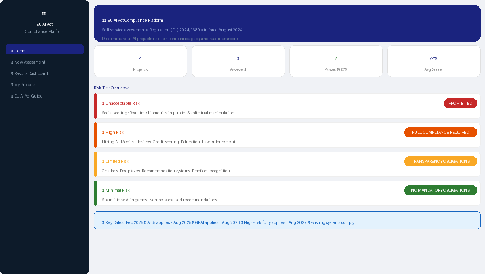
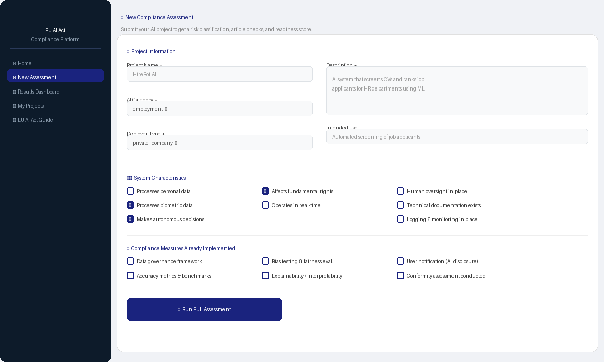
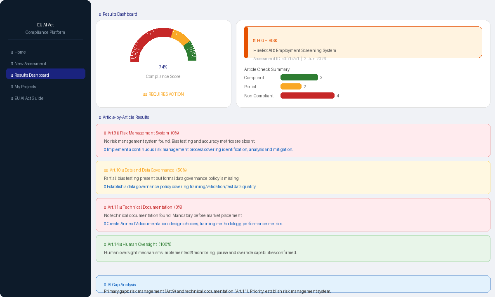

<!-- Banner -->
<div align="center">


<h1>EU AI Act Compliance Platform</h1>

<p><strong>Self-service AI compliance assessment, risk classification, and audit reporting tool</strong><br>
Built on Regulation (EU) 2024/1689 — the world's first comprehensive AI law</p>

<p>
  
  
  
  
  
</p>

<p>
  <a href="https://YOUR_USERNAME-eu-ai-act-platform-app.streamlit.app">
    
  </a>
</p>

</div>

---

## 📌 What Is This?

The **EU AI Act Compliance Platform** is an open-source self-service tool that helps developers, researchers, and organisations understand whether their AI project complies with the **EU AI Act (Regulation 2024/1689)**.

Any team building or deploying an AI system can use this platform to:

- 🔍 **Classify** their system's risk tier (Unacceptable / High / Limited / Minimal)
- 📋 **Check compliance** article-by-article (Art.5 through Art.50)
- 📊 **Get a readiness score** (0–100%) with per-article breakdown
- 🤖 **Receive AI-powered gap analysis** identifying what is missing and why it matters
- 📄 **Download an audit-ready PDF report** for stakeholders or legal review
- 📖 **Learn the law** through a built-in reference guide

> **Inspired by** [AISC](https://github.com/lux-ai-factory/aisc) by Luxembourg LIST/SnT

---

## 🖼️ Screenshots

**🏠 Dashboard — Risk tier overview and project stats**



**🔍 New Assessment — Submit your AI project**



**📊 Results — Compliance score, article checks, and gap analysis**



---

## 🚀 Quick Start

### Option A — Run locally (Full stack)

```bash
# 1. Clone
git clone https://github.com/YOUR_USERNAME/eu-ai-act-platform.git
cd eu-ai-act-platform

# 2. Set up environment
cp .env.example .env
# Edit .env → add your GROQ_API_KEY (free at console.groq.com)

# 3. Start FastAPI backend (Terminal 1)
cd apps/api
python -m venv .venv
source .venv/bin/activate        # Windows: .\.venv\Scripts\activate
pip install ".[dev]"
uvicorn core.main:app --reload
# → http://127.0.0.1:8000/docs

# 4. Start Streamlit frontend (Terminal 2)
cd apps/streamlit
pip install -r requirements.txt
streamlit run app.py
# → http://localhost:8501
```

### Option B — Standalone Streamlit only (no backend)

```bash
git clone https://github.com/YOUR_USERNAME/eu-ai-act-platform.git
cd eu-ai-act-platform
pip install -r requirements.txt
streamlit run app.py
```

---

## 🏗️ Architecture

```
eu-ai-act-platform/
├── apps/
│   ├── api/                          # FastAPI backend
│   │   ├── core/
│   │   │   ├── config.py             # Pydantic-settings config
│   │   │   └── main.py               # App factory, routing
│   │   ├── models/
│   │   │   └── schemas.py            # All Pydantic schemas
│   │   ├── services/
│   │   │   ├── eu_ai_act_rules.py    # ⭐ Core rule engine
│   │   │   ├── llm_service.py        # AI gap analysis
│   │   │   └── project_store.py      # JSON persistence
│   │   ├── routers/
│   │   │   ├── classify.py           # Risk classification
│   │   │   ├── assess.py             # Full assessment
│   │   │   ├── projects.py           # Project CRUD
│   │   │   └── report.py             # PDF generation
│   │   └── utils/
│   │       └── pdf_report.py         # ReportLab PDF builder
│   └── streamlit/
│       ├── app.py                    # 5-page Streamlit UI
│       └── api_client.py             # HTTP client wrapper
├── docs/
│   └── screenshots/                  # README screenshots
├── .env.example
├── requirements.txt
└── README.md
```

---

## 📋 EU AI Act Risk Tiers

| Tier | Examples | Requirements |
|---|---|---|
| 🔴 **Unacceptable** | Social scoring · Real-time biometrics in public · Subliminal manipulation | **PROHIBITED** — cannot be deployed |
| 🟠 **High Risk** | Hiring AI · Medical devices · Credit scoring · Education · Law enforcement | Full compliance — Articles 9–16 + conformity assessment |
| 🟡 **Limited Risk** | Chatbots · Deepfakes · Recommendation systems | Transparency obligations — Art.50 |
| 🟢 **Minimal Risk** | Spam filters · AI in games | No mandatory requirements |

---

## 📐 Articles Covered

| Article | Title | Applies To |
|---|---|---|
| Art.5  | Prohibited AI Practices | Unacceptable |
| Art.9  | Risk Management System | High Risk |
| Art.10 | Data and Data Governance | High Risk |
| Art.11 | Technical Documentation | High Risk |
| Art.12 | Record-Keeping and Logging | High Risk |
| Art.13 | Transparency | High + Limited |
| Art.14 | Human Oversight | High Risk |
| Art.15 | Accuracy, Robustness, Cybersecurity | High Risk |
| Art.43 | Conformity Assessment | High Risk |
| Art.50 | Transparency for Certain AI Systems | Limited Risk |

---

## 🤖 AI-Powered Gap Analysis

Uses LLMs to provide human-readable explanation of compliance gaps, deployment risks, and concrete next steps.

### Supported LLM Providers

| Provider | Cost | Key |
|---|---|---|
| [Groq](https://console.groq.com) | 🆓 Free | `GROQ_API_KEY=gsk_...` |
| [Google Gemini](https://aistudio.google.com) | 🆓 Free tier | `GEMINI_API_KEY=AIza...` |
| [Ollama](https://ollama.com) | 🆓 Local | No key needed |
| OpenAI | 💳 Paid | `OPENAI_API_KEY=sk-...` |

> Works fully **without any API key** — rule-based classification and article checks run offline. Only the AI gap analysis paragraph requires a key.

---

## ☁️ Deploy to Streamlit Cloud (Free)

1. Fork this repository
2. Go to [share.streamlit.io](https://share.streamlit.io)
3. Connect GitHub → select this repo → `app.py` → **Deploy**
4. Add `GROQ_API_KEY` in **Settings → Secrets**

---

## 🗺️ Roadmap

- [ ] GPAI model assessment (Art.51–55)
- [ ] Multi-language support (DE, FR, ES)
- [ ] Team collaboration and shared projects
- [ ] CI/CD compliance gate via API webhook
- [ ] GDPR cross-compliance checker
- [ ] Automated re-assessment on regulation updates

---

## 🤝 Contributing

1. Fork the repo
2. Create a branch: `git checkout -b feature/your-feature`
3. Commit: `git commit -m "Add your feature"`
4. Push: `git push origin feature/your-feature`
5. Open a Pull Request

---

## 📚 References

- 📜 [EU AI Act Full Text (EUR-Lex)](https://eur-lex.europa.eu/legal-content/EN/TXT/?uri=CELEX:32024R1689)
- 🏛️ [European AI Office](https://digital-strategy.ec.europa.eu/en/policies/european-ai-office)
- 🗄️ [EU AI Act Database](https://artificialintelligenceact.eu/)
- 🔬 [AISC by LIST/SnT Luxembourg](https://github.com/lux-ai-factory/aisc)

---

## ⚠️ Disclaimer

This platform is a **self-assessment tool** and does not constitute legal advice. For official conformity assessment, consult a notified body or qualified legal counsel.

Reference: Regulation (EU) 2024/1689 of the European Parliament and of the Council of 13 June 2024.

---

## 📝 License

MIT License — free to use, modify, and distribute.

---

<div align="center">
  <p>Built to make EU AI Act compliance accessible to every developer and team</p>
</div>
